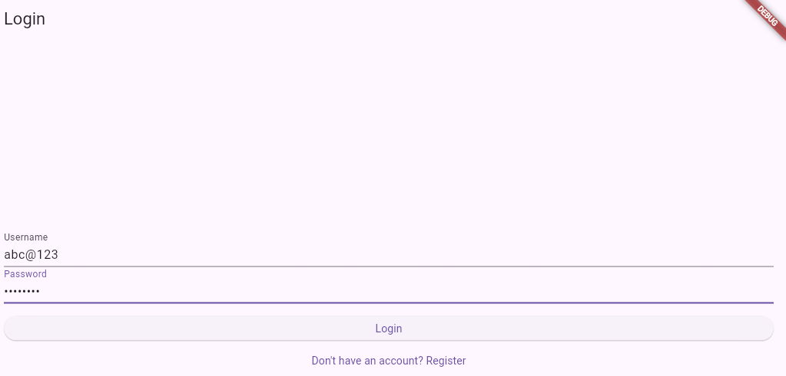

# Django Token Auth Backend

A small Django REST Framework backend providing username/password
registration, login, and profile management using DRF's token authentication.

---

## Files

### `user/serializers.py`

- **`RegisterSerializer`** — a `ModelSerializer` on `User` with `id`,
  `username`, `email`, `password`. The `password` field is write-only with a
  6-character minimum. `create()` uses `User.objects.create_user(...)` so the
  password is hashed rather than stored in plain text.
- **`LoginSerializer`** — a plain `Serializer` taking `username` and
  `password`. `validate()` calls Django's `authenticate()`; on failure it
  raises a `ValidationError('Invalid username or password')`, on success it
  attaches the resolved `user` object into `validated_data` for the view to use.
- **`ProfileSerializer`** — a `ModelSerializer` on `User` exposing `id`,
  `username`, `email`, `first_name`, `last_name`. Used both to return the
  logged-in user's data and to validate partial profile updates.

### `user/views.py`

- **`RegisterView(generics.CreateAPIView)`** — overrides `create()` to
  validate input via `RegisterSerializer`, save the new user, issue (or
  fetch) a `Token` for them, and respond with `201` and `{ token, user }`.
- **`LoginView(APIView)`** — validates credentials via `LoginSerializer`,
  gets or creates a `Token` for the authenticated user, and responds with
  `{ token, user }`.
- **`ProfileView(APIView)`**, gated by `IsAuthenticated`:
  - `GET` returns the requesting user's serialized profile.
  - `PUT` applies a partial update to the requesting user's profile via
    `ProfileSerializer(request.user, data=request.data, partial=True)`.

### `user/urls.py`

```
POST /register/   → RegisterView
POST /login/      → LoginView
GET  /profile/    → ProfileView
PUT  /profile/    → ProfileView
```

### `user_auth/urls.py`

The project's root URLconf. It mounts `user.urls` twice — once at `api/` and
again at `api/auth/` — so every endpoint above resolves under both prefixes,
alongside the default `admin/` route.

---

## API reference

| Endpoint | Method | Auth required | Body | Success response |
|---|---|---|---|---|
| `/api/auth/register/` | POST | No | `username`, `email`, `password` | `201` — `{ token, user }` |
| `/api/auth/login/` | POST | No | `username`, `password` | `200` — `{ token, user }` |
| `/api/auth/profile/` | GET | Yes (`Authorization: Token <token>`) | — | `200` — user object |
| `/api/auth/profile/` | PUT | Yes (`Authorization: Token <token>`) | any of `first_name`, `last_name`, `email` | `200` — updated user object |

---

## App in action

These screenshots were taken from a Flutter client exercising the endpoints
above — login, and the profile screen after fetching and editing the
authenticated user's details.

| Login | Profile |
|---|---|
|  | .png) |

---

## Setup

```bash
python manage.py migrate
python manage.py runserver 0.0.0.0:8000
```

`rest_framework.authtoken` must be listed in `INSTALLED_APPS` for
`Token.objects.get_or_create()` to work — run `migrate` again after adding it
if it wasn't already present.

---

## Notes / possible next steps

- Password strength is only checked for a minimum length; consider wiring in
  Django's built-in `AUTH_PASSWORD_VALIDATORS` for stronger rules.
- Tokens issued by `rest_framework.authtoken` don't expire. For anything
  beyond a demo, consider `djangorestframework-simplejwt` for short-lived,
  refreshable tokens.
- CORS isn't configured here — add `django-cors-headers` if a web frontend on
  a different origin needs to call these endpoints.
